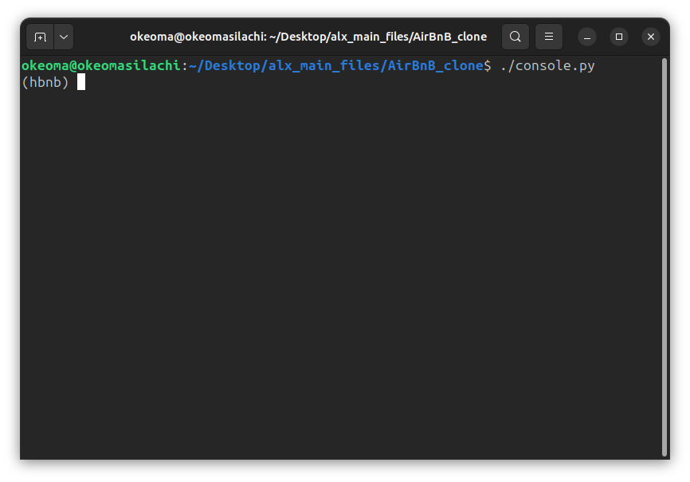
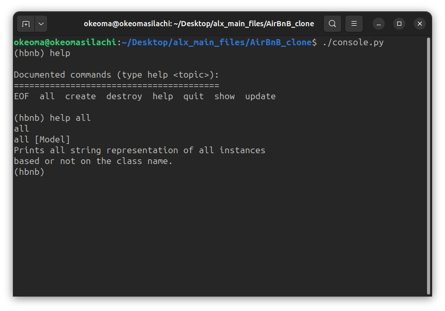

# AirBnB_Clone Project
## Command Interpreter

The command interpreter is a tool that allows users to interact with the application through a command-line interface. It provides functionalities to manage instances of various classes.

### Starting the Command Interpreter

To start the command interpreter, run the following command:
```Bash
$ ./console.py
```


How to Use the Command Interpreter
Once the command interpreter is running, you can use the following commands:

`quit or EOF`:
Exits the program. 

`help`: Displays the list of available commands and their descriptions.


#### Available Commands
`create <class_name>`: Creates a new instance of the specified class, saves it to the JSON file, and prints its unique ID.

***Example***:
```Bash
(hbnb) create BaseModel
```

<br>

`show <class_name> <id>`: Prints the string representation of an instance based on the class name and ID.

***Example***:
```Bash
(hbnb) show BaseModel 1234-1234-1234
```

<br>

`destroy <class_name> <id>`: Deletes an instance based on the class name and ID, and saves the change to the JSON file.


***Example***: 
```Bash
(hbnb) destroy BaseModel 1234-1234-1234
```

<br>

`all [class_name]`: Prints all string representations of instances of the specified class. If no class name is provided, it prints all instances of all classes.


<br>

***Example***: 
```Bash
(hbnb) all BaseModel
```

`<class_name>.all()`: Retrieves all instances of the specified class.


`<class_name>.count()`: Retrieves the number of instances of the specified class.


`<class_name>.show(<id>)`: Retrieves an instance based on its ID.


`<class_name>.destroy(<id>)`: Destroys an instance based on its ID.


`<class_name>.update(<id>, <attribute_name>, <attribute_value>)`: Updates an instance by adding or updating an attribute.


`<class_name>.update(<id>, <dictionary_representation>)`: Updates an instance using a dictionary representation.

<br>

***Examples***


Here are some examples of how to use the command interpreter:

Creating an instance of BaseModel:

```Bash
(hbnb) create BaseModel
```

Showing an instance:

```Bash
(hbnb) show BaseModel 1234-1234-1234
```

Destroying an instance:

```Bash
(hbnb) destroy BaseModel 1234-1234-1234
```

Retrieving all instances of BaseModel:

```Bash
(hbnb) BaseModel.all()
```

Retrieving the number of instances of BaseModel:

```Bash
(hbnb) BaseModel.count()
```

Retrieving an instance by ID:

```Bash
(hbnb) BaseModel.show(1234-1234-1234)
```

Destroying an instance by ID:

```Bash
(hbnb) BaseModel.destroy(1234-1234-1234)
```

Updating an instance using attribute name and value:

```Bash
(hbnb) update BaseModel 1234-1234-1234 email "aibnb@mail.com"
```

Updating an instance using a dictionary representation:

```Bash
(hbnb) update BaseModel 1234-1234-1234 {'email': 'aibnb@mail.com', 'first_name': 'John'}
```
<br>

### File Storage

The File Storage class handles the serialization and deserialization of instances to and from a JSON file. It manages instances of the following classes: BaseModel, Place, State, City, Amenity, and Review.


Usage
To use the application, follow these steps:

- Clone the repository.
- Run the command interpreter using ./console.py.
- Use the available commands to interact with the application.

***Dependencies***
Python (>=3.8)
